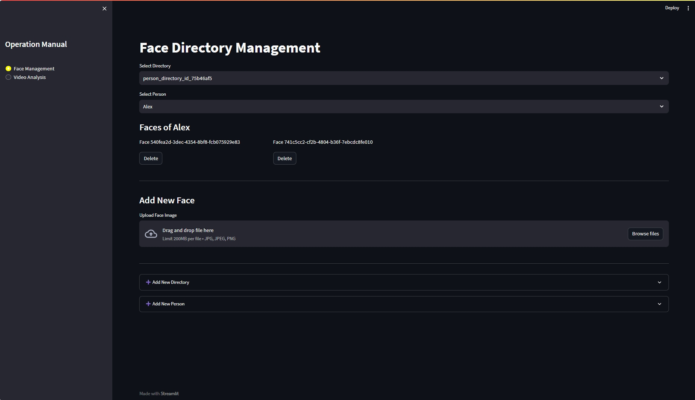
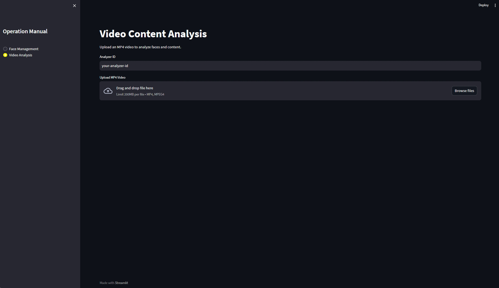

# Streamlit Frontend for Azure AI Content Understanding






This Streamlit app provides a modern, user-friendly interface for managing face directories and analyzing video content using Azure AI Content Understanding services.

## Features

- **Face Management**
  - List and select face directories
  - List and select persons within a directory
  - View, add, and delete face images for each person
  - Add new directories and persons
- **Video Analysis**
  - Upload an MP4 video and analyze it using a specified analyzer
  - View structured analysis results in JSON format

## Requirements

- Python 3.8+
- Login by using Azure CLI
- [Streamlit](https://streamlit.io/)
- [Pillow](https://pillow.readthedocs.io/)
- [python-dotenv](https://pypi.org/project/python-dotenv/)
- [azure-identity](https://pypi.org/project/azure-identity/)
- Azure AI Content Understanding backend Python client modules (`content_understanding_face_client.py`, `content_understanding_client.py`)
- opencv-python-headless

Install dependencies:

```sh
pip install streamlit pillow python-dotenv azure-identity
```

Azure CLI Login:
Install [Azure CLI](https://aka.ms/azure-cli), and Login into your Azure account by:

```sh
az login
```

Then selcet an available subscription from your account.


## Environment Variables

Create a `.env` file in the same directory as your app with the following content:

```
AZURE_AI_ENDPOINT=your-azure-endpoint
AZURE_AI_API_VERSION=your-api-version
AZURE_SUBSCRIPTION_KEY=your-subscription-key
```

## Usage

1. Make sure the backend Python client modules are available in `../backend/` relative to this app.
2. Start the app from the `app/frontend` directory:

   ```sh
   streamlit run frontend/streamlit_app.py
   ```

3. Open the provided local URL in your browser.

4. For analyzer ID, use: 
  ``` sh
  prebuilt-videoAnalyzer
  ```

## How It Works

- The app uses Azure identity credentials and token provider for authentication.
- All face management and video analysis operations are performed via direct calls to the Python client classes.
- The UI is organized into two main modules (selectable from the sidebar):
  - **Face Management**: Manage directories, persons, and face images.
  - **Video Analysis**: Upload and analyze videos, view results.

## Notes

- When adding a new directory or person, the UI updates automatically.
- Face images are displayed using PIL and base64 decoding.
- For security, avoid using `eval` on untrusted input; consider using `ast.literal_eval` for parsing JSON-like tags.

## License

MIT License
